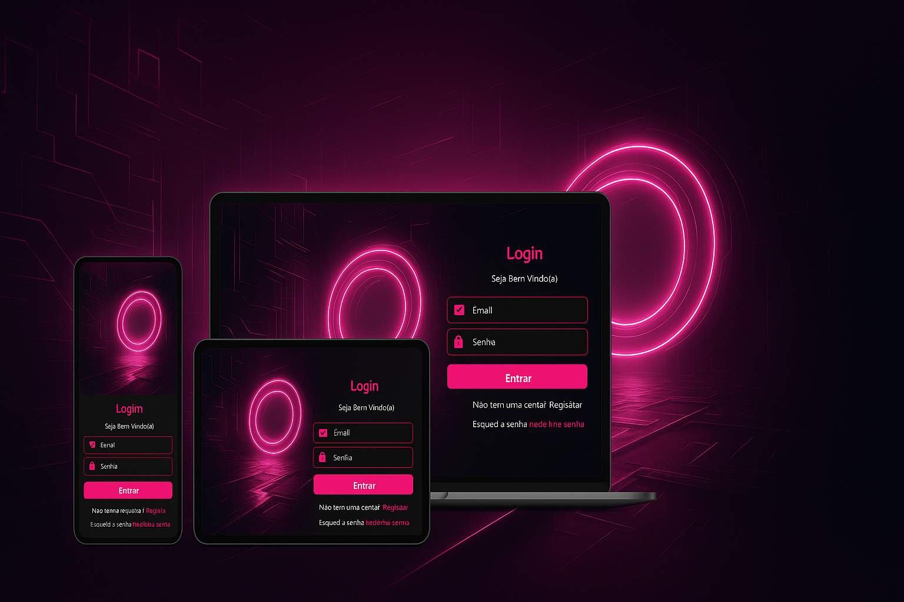

<!-- Imagem de Capa -->
<p align="center">
  
</p>

# 💻 Projeto: Tela de Login Responsiva com Estilo Futurista
<p align="center">
  <a href="https://tattianerl.github.io/">
    
  </a>
</p>

Este é um projeto de uma **tela de login moderna e responsiva**, com um design futurista em tons de rosa neon. A interface se adapta a diferentes dispositivos: **mobile, tablet, notebook e desktop**, usando `flexbox` e `media queries`.

---

## 🔥 Funcionalidades

- Layout adaptável para diferentes tamanhos de tela.
- Estilização moderna com foco em experiência visual.
- Ícones do Google Material Icons para os campos do formulário.
- Design escuro com tons neon.
- Estrutura HTML + CSS separada.
- Preparado para integração com back-end (`login.php`).

---

## 📱 Responsividade

| Dispositivo | Layout                                                 |
|-------------|--------------------------------------------------------|
| Mobile      | Imagem acima, formulário abaixo                        |
| Tablet      | Imagem à direita, formulário à esquerda                |
| Notebook    | Imagem à direita, formulário à esquerda                |
| Desktop     | Imagem à esquerda, formulário à direita (invertido)    |

---

## 🛠️ Tecnologias Utilizadas

- HTML5  
- CSS3  
- Flexbox  
- Media Queries  
- Google Fonts  
- Google Material Icons  

---

## 🖼️ Preview da Tela

- [📱 Tela Mobile](./imagens/tela-mobile.png)
- [📟 Tela Tablet](./imagens/tela-tablet.png)
- [🖥️ Telas Maiores (Notebook/Desktop)](./imagens/telas-maiores.png)

---

## 🚀 Como Usar

1. Clone o repositório:
   ```bash
   git clone https://github.com/Tattianerl/projeto-login.git
